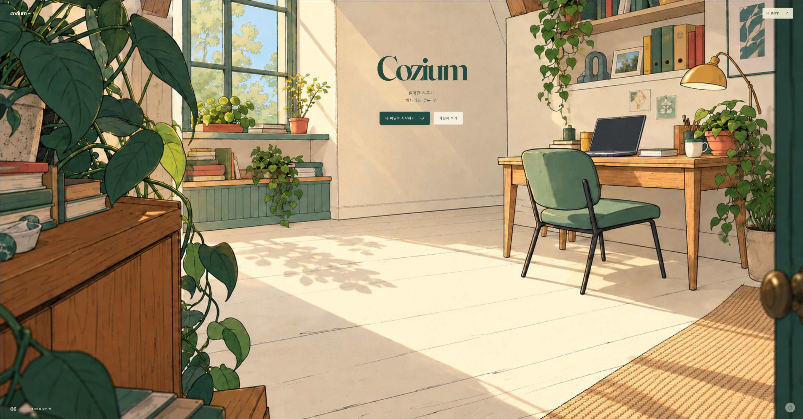

# Cozium

> 흩어진 하루가 제자리를 찾는 곳.

Cozium은 바탕화면의 파일을 손으로 집어 상자에 담는 웹 디자인 프로토타입입니다. 따뜻한 방과 이삿짐 상자로 시작하는 랜딩에서 정리의 감각을 경험한 뒤, 샘플 파일이나 사용자가 가져온 파일로 3D 정리방에 들어갑니다.



## 빠르게 실행하기

Node.js 20 이상이 필요합니다. 외부 패키지 의존성이 없고 Three.js와 랜딩 서체를 저장소에 포함하므로 `npm install`과 별도 빌드 과정은 필요하지 않습니다.

```bash
npm run dev
```

브라우저에서 [http://localhost:5173/](http://localhost:5173/)를 엽니다. HTML 파일을 직접 열기보다 제공된 서버를 사용하세요.

| 페이지 | 용도 |
| --- | --- |
| `/` | Cozium 랜딩: 방 → 상자 열기 → 샘플 정리 → 정돈된 방 |
| `/app.html?entry=files` | **내 파일로 시작하기**: 파일 가져오기 화면 |
| `/app.html?entry=sample&storage=memory` | **체험해 보기**: 샘플 3D 정리방 바로 시작 |
| `/app.html?storage=memory&view=2d` | 개발용 2D 보드 비교 |

랜딩의 마지막 두 버튼은 같은 정리 앱으로 이어집니다. `landing.html`과 이전 `docs/landing-direction-v3/landing-direction.html` 주소도 새 랜딩으로 연결됩니다.

## 파일은 어떻게 다루나요?

| 모드 | 가져오는 항목 | 파일 이동·새 폴더·되돌리기 |
| --- | --- | --- |
| 샘플 체험 | 프로젝트의 가상 파일 | 메모리에서만 반영 |
| 웹 체험 (`WebDropProvider`) | 사용자가 직접 드롭한 파일·폴더 | **읽기 전용.** 정리 계획만 만들며 디스크는 변경하지 않음 |
| Desktop Helper (`NativeHelperProvider`) | 지정한 바탕화면 폴더를 스캔 | **실제 파일에 반영.** 로컬 Helper를 별도로 실행해야 함 |

웹 체험은 데스크톱 Chrome 또는 Edge의 파일 핸들 기능과 HTTPS 또는 localhost 환경을 사용합니다. 바탕화면에서 정리할 파일과 목적지 폴더를 선택해 가져오기 영역에 드롭하고 시작합니다. 웹페이지가 바탕화면 전체를 자동으로 읽지는 않습니다.

Helper는 바탕화면 범위 안에서 파일을 옮기고 새 폴더를 만들며 이동을 되돌립니다. 삭제 API가 없고 동명 파일을 덮어쓰지 않습니다. 되돌릴 때도 이동한 파일의 정체를 확인합니다. 테스트할 때는 반드시 더미 폴더를 지정하세요.

아래 경로를 준비한 테스트 폴더의 절대 경로로 바꿔 실행합니다. 개발 서버는 다른 터미널에서 계속 켜 둡니다.

```bash
node helper/desktop-helper.mjs --dev --app http://localhost:5173/app.html --desktop "<테스트 폴더의 절대 경로>"
```

연결 주소·포트·토큰이 콘솔에 표시됩니다. 옵션과 파일 작업 범위는 [Helper README](helper/README.md)에 설명되어 있습니다.

## 현재 구현

- **랜딩:** 방 파츠 합성, 상자 낙하와 클릭, 테이프 벗기기, 상자 열기, 80개 샘플 아이콘 모으기, 상자 닫기, 정돈된 방과 두 시작 버튼.
- **정리 앱:** 3D 방에서 파일 집기·여러 파일 담기·폴더에 넣기, 하위 폴더 탐색, 새 폴더, 이동 결과 기록과 되돌리기. `?view=2d`로 2D 보드도 비교할 수 있습니다.
- **상자 배치:** 파일 정리와 별도 모드에서 상자 위치·방향을 바꾸고 되돌립니다. 위치는 현재 세션에만 저장됩니다.
- **화면 표현:** 3D 방의 그림 질감과 외곽선 설정을 비교할 수 있습니다.

랜딩에서 움직이는 아이콘은 연출용 샘플입니다. 랜딩의 상자에 담는 동작은 실제 파일 작업과 연결되지 않습니다. 현재 파일 가져오기 화면은 기존 UI를 사용하며, 랜딩과 같은 톤으로 다시 디자인할 예정입니다. [가져오기 화면 시안](docs/design/onboarding-concept.png)은 생성한 디자인 참고 이미지이며 아직 구현하지 않았습니다.

디자인 이야기와 화면별 역할은 [디자인 문서](docs/design.md), 이전 구현 과정과 검증 기록은 [개발 이력](docs/development-history.md)에 보관했습니다.

## 기본 조작

랜딩에서 아래로 스크롤해 상자를 도착시키고 클릭합니다. 테이프 끝을 오른쪽 위로 당겨 상자를 연 뒤, 바탕화면의 아이콘을 누르고 훑어 정리 상자에 담습니다. 모두 담은 상자를 클릭하면 마지막 방으로 돌아갑니다. 테이프에는 Enter/Space 대체 조작이 있고, 샘플 아이콘은 방향키와 Enter/Space로도 선택·이동·놓기가 가능합니다.

3D 정리방에서는 첫 클릭으로 시점을 잡고, Esc로 마우스를 놓습니다.

| 조작 | 동작 |
| --- | --- |
| 마우스 / WASD·방향키 | 둘러보기 / 이동 |
| 파일 클릭·누른 채 훑기 | 파일 한 개 또는 여러 개 집기 |
| 폴더 클릭 / 1–9 | 들고 있는 파일 넣기 |
| 빈손으로 폴더 클릭 | 폴더 열기 |
| 우클릭 | 파일 내려놓기 / 미확정 상자 배치 취소 |
| Ctrl+Z | 현재 모드의 마지막 작업 되돌리기 |
| Tab | 파일 정리 / 상자 배치 전환 |
| 배치 중 휠 | 상자 회전 |

## 테스트와 확인 범위

```bash
npm test
```

현재 테스트 실행기는 `tests/`, `tests/landing/`, `helper/`의 지정된 테스트만 수집합니다. 이전 랜딩과 백업의 테스트는 현재 실행 대상에서 제외합니다.

- 정리 앱: 가짜 파일 핸들·메모리 Provider를 사용한 가져오기, 가상 이동, 세션 상태, 충돌, 폴더 탐색, 배치·회전.
- 랜딩: 테이프 입력·형상, 덮개 형상, 장면 전환, 아이콘 물리·입력, 상자 상태, 마지막 방 전환과 초기화.
- Helper: 임시 폴더에서 동명 충돌과 동시 이동, 파일 정체 확인, 되돌리기, 경로 범위, Origin·토큰·본문 제한.

최종 검증 (2026-10-06): `npm test` **237개 통과, 실패 0개**. 브라우저에서 루트 랜딩 → 상자 열기 → 세 번의 드래그로 80개 담기 → 마지막 방을 확인했고, 두 시작 버튼과 이전 주소의 연결도 확인했습니다. 샘플 정리방은 파일 45개와 3D 캔버스가 표시되었습니다. 브라우저 오류 로그는 비어 있었습니다.

검증 환경: Windows, Node.js `v24.18.0` (전체 npm 테스트), `v24.19.0` (분리된 랜딩·경로 테스트). 실제 Windows 바탕화면에서의 파일 작업, 일반 브라우저의 포인터 락, 장치별 WebGL 성능과 모바일 조작은 이번 확인 범위에 포함하지 않았습니다. 배포된 HTTPS 페이지에서 localhost Helper로 연결할 때의 브라우저 권한 흐름도 실제 기기에서 별도 확인이 필요합니다.

## GitHub Pages 배포

이 프로젝트는 정적 HTML·CSS·JavaScript로 배포합니다. 저장소 루트에 `index.html`과 `.nojekyll`을 포함해 올린 뒤, GitHub의 **Settings → Pages → Build and deployment → Source → Deploy from a branch**에서 배포할 브랜치와 **/(root)**를 선택합니다. [GitHub 공식 배포 안내](https://docs.github.com/en/pages/getting-started-with-github-pages/configuring-a-publishing-source-for-your-github-pages-site)를 참고하세요.

페이지와 에셋은 `./` 기준의 상대 주소를 사용하므로 프로젝트 사이트의 `/저장소이름/` 경로 아래에서도 배포할 수 있습니다. GitHub Pages는 웹 파일만 제공합니다. Helper는 사용자의 컴퓨터에서 별도로 실행합니다.

자신의 GitHub 계정·저장소로 배포한다면 아래 `OWNER`, `REPOSITORY`와 테스트 폴더 경로를 실제 값으로 바꿉니다. `--origin`에는 사이트의 출처만, `--app`에는 정리 앱의 전체 주소를 넣습니다.

```bash
node helper/desktop-helper.mjs --origin https://OWNER.github.io --app https://OWNER.github.io/REPOSITORY/app.html --desktop "<테스트 폴더의 절대 경로>"
```

배포 주소에서 두 시작 버튼, 이미지·서체 로딩, 샘플 정리방 진입을 확인하세요. HTTPS 페이지와 로컬 Helper 사이의 연결 허용 방식은 브라우저·환경에 따라 실기기 검수가 필요합니다.

## 프로젝트 구조

```text
index.html                 최신 Cozium 랜딩
app.html                   파일 가져오기 + 3D/2D 정리 앱
landing.html               이전 랜딩 주소 호환
css/
  landing.css              랜딩 스타일
  styles.css               정리 앱 스타일
js/
  landing/                 방·상자·테이프·아이콘·장면 전환
  app.js                   Provider, 상태, UI 연결
  providers/               웹 읽기 전용 / Helper / 샘플
  state/                   정리 세션과 작업 이력
  ui/                      온보딩, 2D 보드, 폴더 내부, 상태 표시
  three/                   3D 장면, 카드·상자, 질감·외곽선
assets/landing/
  parts/room-v3/            방 파츠
  parts/desktop-v2/         랜딩 샘플 바탕화면 파츠
  box/                     상자·테이프 연출 에셋
  fonts/                   Fraunces 서체와 OFL
vendor/three/              포함된 Three.js와 MIT 라이선스
helper/                    로컬 파일 작업 서버와 테스트
tests/                     정리 앱 테스트
  landing/                 현재 랜딩 테스트
tools/                     개발 서버, 테스트 실행기, 에셋 생성기
docs/                      디자인 문서, 화면, 개발 이력
_archive/                  로컬 작업 기록 (.gitignore로 제외)
```

## 에셋과 라이선스

Three.js r185는 [MIT 라이선스](vendor/three/LICENSE), Fraunces는 [SIL Open Font License 1.1](assets/landing/fonts/OFL.txt)로 포함되어 있습니다. 방·상자 일러스트는 이미지 생성·편집으로 제작했고, 샘플 바탕화면의 SVG 파츠는 프로젝트 코드로 만들었습니다. 에셋의 구성과 제작 기록은 [디자인 문서](docs/design.md)를 참고하세요.

프로젝트 자체의 공개 라이선스는 아직 지정하지 않았습니다. 포함된 라이브러리·서체의 라이선스는 각각의 원문을 따릅니다.
