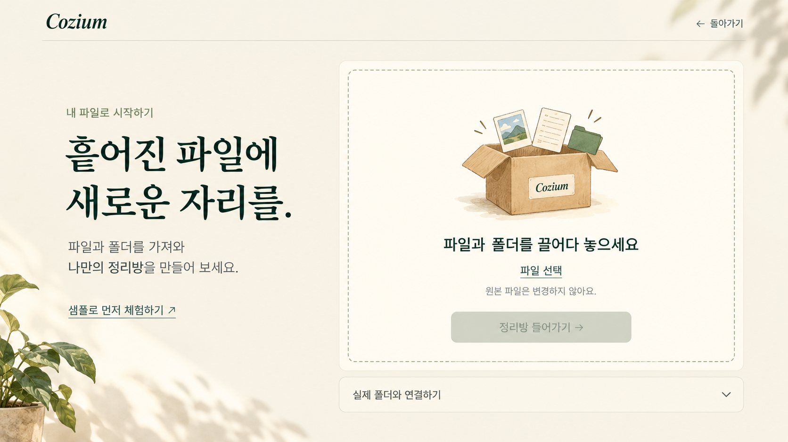

# Cozium의 디자인 이야기

Cozium은 흩어진 파일을 차가운 목록 대신, 아직 자리를 찾지 못한 물건으로 바라봅니다. 파일을 집고 상자에 담는 행동이 정리를 설명하도록 따뜻한 방, 종이, 크래프트 상자와 깊은 녹색을 중심으로 화면을 구성했습니다.

## 구현된 랜딩

랜딩은 처음 본 방으로 돌아오는 하나의 짧은 여정입니다.

1. **아직, 자리를 찾는 중:** 햇빛이 들어오는 방과 흩어진 종이·사진에서 시작합니다.
2. **새 자리에 도착한 것들:** 아래로 스크롤하면 이삿짐 상자가 내려옵니다. 착지한 상자는 사용자의 클릭을 기다립니다.
3. **새 자리를 위한 준비:** 상자를 클릭하면 가까이 다가가 위에서 내려다보는 구도로 전환합니다.
4. **비어 있는 상자, 새로운 시작:** 테이프 끝을 당겨 벗기면 덮개가 열리고 바탕화면으로 이어집니다.
5. **정리하기:** 샘플 아이콘 80개가 바닥에 모입니다. 누른 채 훑으면 주변 아이콘이 따라오고, 정리 상자에 놓으면 안에 담깁니다. 모두 담은 뒤 닫힌 상자를 선택합니다.
6. **제자리를 찾은 방:** 담긴 내용물을 보여준 뒤 정돈된 같은 방으로 돌아갑니다. 제목과 두 시작 버튼이 나타납니다.

**내 파일로 시작하기**는 `app.html?entry=files`의 가져오기 화면으로, **체험해 보기**는 `app.html?entry=sample&storage=memory`의 샘플 3D 정리방으로 이어집니다. 랜딩의 아이콘은 연출용이며 실제 파일과 연결되지 않습니다.

첫 장면과 마지막 장면은 같은 방과 카메라 구도를 공유합니다. 정리하기 전후의 감각을 새로운 장소가 아닌 익숙한 장소의 변화로 보여주려는 구성입니다.

## 표현 방식

방은 1672×941 기준의 배경과 투명 전경 파츠를 Canvas에서 합성합니다. 이미지로 만든 방에 HTML 제목·링크·버튼을 올리고, 상자·테이프·덮개·바탕화면 전환을 별도 모듈에서 처리합니다. 랜딩 자체는 3D 방 모델이 아닙니다.

파일 정리 앱은 별도의 Three.js 3D 장면을 사용합니다. 실제 파일 이름과 상태를 카드로 표현하고 폴더를 목적지 상자로 표시합니다. 웹·샘플·Helper의 파일 처리 차이는 Provider에 두어 같은 정리 조작을 공유합니다.

원화의 따뜻한 종이색과 녹색, 낮고 넓은 이삿짐 상자, Fraunces 제목 서체를 화면의 기준으로 삼았습니다. `prefers-reduced-motion`을 반영하는 전환과 테이프·샘플 아이콘의 키보드 대체 입력이 구현되어 있습니다. 전체 접근성이나 실제 모바일 기기 검수를 완료했다는 뜻은 아닙니다.

## 파일 가져오기 화면의 다음 방향

현재 `app.html`은 기존의 웹 드롭·Helper 연결 UI를 사용합니다. 랜딩의 마지막 장면에서 가져오기 화면으로 넘어갈 때 시각적 톤을 이어 주는 재설계가 다음 작업입니다.

위 이미지는 이미지 생성으로 만든 **미구현 시안**입니다. 클릭 가능한 웹 화면이나 현재 앱의 캡처가 아닙니다. 가져오기 영역, 샘플 시작, 실제 파일 반영에 필요한 Helper의 역할을 한 화면에서 이해할 수 있도록 다듬는 참고 자료입니다. 구체적인 구성과 문구는 구현 단계에서 확정해야 합니다.

## 에셋 제작과 기록

| 에셋 | 현재 위치 | 제작·출처 |
| --- | --- | --- |
| 방 배경·전경 | `assets/landing/parts/room-v3/` | 이미지 생성 후 편집·투명 파츠 추출 |
| 상자·테이프 연출 | `assets/landing/box/` | 이미지와 Canvas 연출용 파츠 |
| 샘플 바탕화면 | `assets/landing/parts/desktop-v2/` | 프로젝트의 SVG 생성 코드 |
| Fraunces | `assets/landing/fonts/` | Fraunces Project Authors, SIL OFL 1.1 |
| 정리 앱의 3D 렌더러 | `vendor/three/` | Three.js authors, MIT |

방 파츠는 [room-v3 README](../assets/landing/parts/room-v3/README.md), 샘플 바탕화면은 [desktop-v2 README](../assets/landing/parts/desktop-v2/README.md)에 규격과 제작 기록이 있습니다. 각 에셋 폴더의 manifest·프롬프트 기록도 함께 보존합니다. 과거 시안·검수 캡처·작업 백업은 현재 구현과 구분해 로컬 `_archive/`에 남깁니다.

